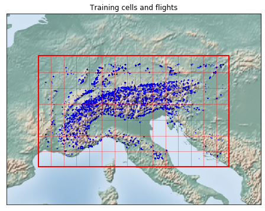
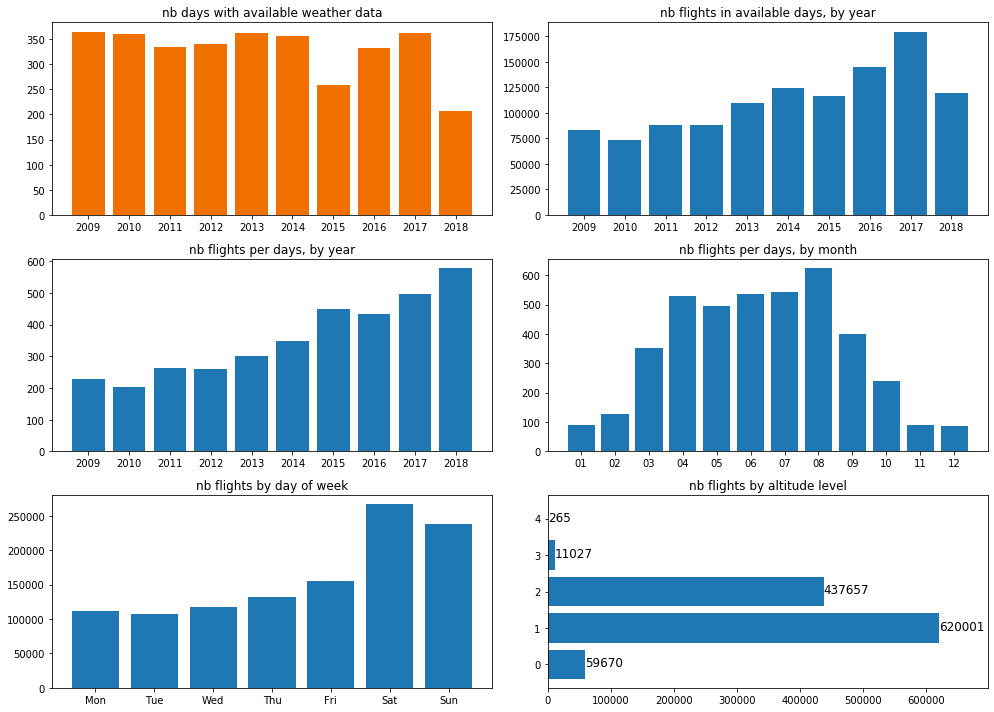
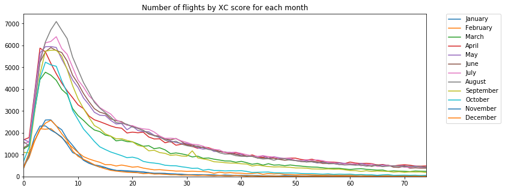

Generated from [docs/documentation.ipynb](docs/documentation.ipynb) by [../scripts/update_nn_README.py](../scripts/update_nn_README.py).

# Table of contents

* [Dataset](#dataset)
	* [Training Area](#training-area)
	* [Flights](#flights)
	* [Weather Parameters](#weather-parameters)
* [Neural Network](#neural-network)
	* [Introduction](#introduction)
	* [Network Architecture](#network-architecture)
		* [Diagram](#diagram)
	* [Population Block](#population-block)
		* [Date and Day of Week Modifiers](#date-and-day-of-week-modifiers)
		* [Cells](#cells)
		* [Spots](#spots)
	* [Wind Block](#wind-block)
		* [Input](#input)
		* [Model](#model)
			* [Cells](#cells-2)
			* [Spots](#spots-2)
* [Training](#training)

# Dataset

The current training area is focused on the Alps as there is no time zone management for now.
This area is segmented in 1°x1°x100hPa cells, corresponding to the GFS Analysis data cells.

## Training Area

## Flights

We consider only the take-off coordinates (latitude, longitude, altitude) of a flight because, far from any take-off area, an absence of flight does not implies non-flyability.

Flights statistics:

    day of week factors: [111383, 107993, 117721, 131987, 154665, 266616, 238255]

## Weather Parameters

The weather paramaters present in the GFS Analysis data has varied with time. We must select a subset present during the whole training interval.

    06:00 Precipitable water                12:00 Precipitable water                18:00 Precipitable water               
    06:00 Cloud water                       12:00 Cloud water                       18:00 Cloud water                      
    06:00 Vertical velocity at 1000 hPa     12:00 Vertical velocity at 1000 hPa     18:00 Vertical velocity at 1000 hPa    
    06:00 Vertical velocity at 900 hPa      12:00 Vertical velocity at 900 hPa      18:00 Vertical velocity at 900 hPa     
    06:00 Vertical velocity at 800 hPa      12:00 Vertical velocity at 800 hPa      18:00 Vertical velocity at 800 hPa     
    06:00 Vertical velocity at 700 hPa      12:00 Vertical velocity at 700 hPa      18:00 Vertical velocity at 700 hPa     
    06:00 Vertical velocity at 600 hPa      12:00 Vertical velocity at 600 hPa      18:00 Vertical velocity at 600 hPa     
    06:00 Vertical velocity at 500 hPa      12:00 Vertical velocity at 500 hPa      18:00 Vertical velocity at 500 hPa     
    06:00 Vertical velocity at 400 hPa      12:00 Vertical velocity at 400 hPa      18:00 Vertical velocity at 400 hPa     
    06:00 Vertical velocity at 300 hPa      12:00 Vertical velocity at 300 hPa      18:00 Vertical velocity at 300 hPa     
    06:00 Vertical velocity at 200 hPa      12:00 Vertical velocity at 200 hPa      18:00 Vertical velocity at 200 hPa     
    06:00 Geopotential Height at 1000 hPa   12:00 Geopotential Height at 1000 hPa   18:00 Geopotential Height at 1000 hPa  
    06:00 Geopotential Height at 900 hPa    12:00 Geopotential Height at 900 hPa    18:00 Geopotential Height at 900 hPa   
    06:00 Geopotential Height at 800 hPa    12:00 Geopotential Height at 800 hPa    18:00 Geopotential Height at 800 hPa   
    06:00 Geopotential Height at 700 hPa    12:00 Geopotential Height at 700 hPa    18:00 Geopotential Height at 700 hPa   
    06:00 Geopotential Height at 600 hPa    12:00 Geopotential Height at 600 hPa    18:00 Geopotential Height at 600 hPa   
    06:00 Geopotential Height at 500 hPa    12:00 Geopotential Height at 500 hPa    18:00 Geopotential Height at 500 hPa   
    06:00 Geopotential Height at 400 hPa    12:00 Geopotential Height at 400 hPa    18:00 Geopotential Height at 400 hPa   
    06:00 Geopotential Height at 300 hPa    12:00 Geopotential Height at 300 hPa    18:00 Geopotential Height at 300 hPa   
    06:00 Geopotential Height at 200 hPa    12:00 Geopotential Height at 200 hPa    18:00 Geopotential Height at 200 hPa   
    06:00 Absolute vorticity at 1000 hPa    12:00 Absolute vorticity at 1000 hPa    18:00 Absolute vorticity at 1000 hPa   
    06:00 Absolute vorticity at 900 hPa     12:00 Absolute vorticity at 900 hPa     18:00 Absolute vorticity at 900 hPa    
    06:00 Absolute vorticity at 800 hPa     12:00 Absolute vorticity at 800 hPa     18:00 Absolute vorticity at 800 hPa    
    06:00 Absolute vorticity at 700 hPa     12:00 Absolute vorticity at 700 hPa     18:00 Absolute vorticity at 700 hPa    
    06:00 Absolute vorticity at 600 hPa     12:00 Absolute vorticity at 600 hPa     18:00 Absolute vorticity at 600 hPa    
    06:00 Absolute vorticity at 500 hPa     12:00 Absolute vorticity at 500 hPa     18:00 Absolute vorticity at 500 hPa    
    06:00 Absolute vorticity at 400 hPa     12:00 Absolute vorticity at 400 hPa     18:00 Absolute vorticity at 400 hPa    
    06:00 Absolute vorticity at 300 hPa     12:00 Absolute vorticity at 300 hPa     18:00 Absolute vorticity at 300 hPa    
    06:00 Absolute vorticity at 200 hPa     12:00 Absolute vorticity at 200 hPa     18:00 Absolute vorticity at 200 hPa    
    06:00 Temperature at 1000 hPa           12:00 Temperature at 1000 hPa           18:00 Temperature at 1000 hPa          
    06:00 Temperature at 900 hPa            12:00 Temperature at 900 hPa            18:00 Temperature at 900 hPa           
    06:00 Temperature at 800 hPa            12:00 Temperature at 800 hPa            18:00 Temperature at 800 hPa           
    06:00 Temperature at 700 hPa            12:00 Temperature at 700 hPa            18:00 Temperature at 700 hPa           
    06:00 Temperature at 600 hPa            12:00 Temperature at 600 hPa            18:00 Temperature at 600 hPa           
    06:00 Temperature at 500 hPa            12:00 Temperature at 500 hPa            18:00 Temperature at 500 hPa           
    06:00 Temperature at 400 hPa            12:00 Temperature at 400 hPa            18:00 Temperature at 400 hPa           
    06:00 Temperature at 300 hPa            12:00 Temperature at 300 hPa            18:00 Temperature at 300 hPa           
    06:00 Temperature at 200 hPa            12:00 Temperature at 200 hPa            18:00 Temperature at 200 hPa           
    06:00 Relative humidity at 1000 hPa     12:00 Relative humidity at 1000 hPa     18:00 Relative humidity at 1000 hPa    
    06:00 Relative humidity at 900 hPa      12:00 Relative humidity at 900 hPa      18:00 Relative humidity at 900 hPa     
    06:00 Relative humidity at 800 hPa      12:00 Relative humidity at 800 hPa      18:00 Relative humidity at 800 hPa     
    06:00 Relative humidity at 700 hPa      12:00 Relative humidity at 700 hPa      18:00 Relative humidity at 700 hPa     
    06:00 Relative humidity at 600 hPa      12:00 Relative humidity at 600 hPa      18:00 Relative humidity at 600 hPa     
    06:00 Relative humidity at 500 hPa      12:00 Relative humidity at 500 hPa      18:00 Relative humidity at 500 hPa     
    06:00 Relative humidity at 400 hPa      12:00 Relative humidity at 400 hPa      18:00 Relative humidity at 400 hPa     
    06:00 Relative humidity at 300 hPa      12:00 Relative humidity at 300 hPa      18:00 Relative humidity at 300 hPa     
    06:00 Relative humidity at 200 hPa      12:00 Relative humidity at 200 hPa      18:00 Relative humidity at 200 hPa     
    06:00 U component of wind at 1000 hPa   12:00 U component of wind at 1000 hPa   18:00 U component of wind at 1000 hPa  
    06:00 U component of wind at 900 hPa    12:00 U component of wind at 900 hPa    18:00 U component of wind at 900 hPa   
    06:00 U component of wind at 800 hPa    12:00 U component of wind at 800 hPa    18:00 U component of wind at 800 hPa   
    06:00 U component of wind at 700 hPa    12:00 U component of wind at 700 hPa    18:00 U component of wind at 700 hPa   
    06:00 U component of wind at 600 hPa    12:00 U component of wind at 600 hPa    18:00 U component of wind at 600 hPa   
    06:00 U component of wind at 500 hPa    12:00 U component of wind at 500 hPa    18:00 U component of wind at 500 hPa   
    06:00 U component of wind at 400 hPa    12:00 U component of wind at 400 hPa    18:00 U component of wind at 400 hPa   
    06:00 U component of wind at 300 hPa    12:00 U component of wind at 300 hPa    18:00 U component of wind at 300 hPa   
    06:00 U component of wind at 200 hPa    12:00 U component of wind at 200 hPa    18:00 U component of wind at 200 hPa   
    06:00 V component of wind at 1000 hPa   12:00 V component of wind at 1000 hPa   18:00 V component of wind at 1000 hPa  
    06:00 V component of wind at 900 hPa    12:00 V component of wind at 900 hPa    18:00 V component of wind at 900 hPa   
    06:00 V component of wind at 800 hPa    12:00 V component of wind at 800 hPa    18:00 V component of wind at 800 hPa   
    06:00 V component of wind at 700 hPa    12:00 V component of wind at 700 hPa    18:00 V component of wind at 700 hPa   
    06:00 V component of wind at 600 hPa    12:00 V component of wind at 600 hPa    18:00 V component of wind at 600 hPa   
    06:00 V component of wind at 500 hPa    12:00 V component of wind at 500 hPa    18:00 V component of wind at 500 hPa   
    06:00 V component of wind at 400 hPa    12:00 V component of wind at 400 hPa    18:00 V component of wind at 400 hPa   
    06:00 V component of wind at 300 hPa    12:00 V component of wind at 300 hPa    18:00 V component of wind at 300 hPa   
    06:00 V component of wind at 200 hPa    12:00 V component of wind at 200 hPa    18:00 V component of wind at 200 hPa   

# Neural Network

## Introduction

The problem of flyability prediction is formulated as a classification problem where the input X is the weather data  in a 3D cell and the output Y is the absence/presence of at least one reported flight in this cell.
We assume that the presence of reported flights implies _flyability_ but, absence of reported flights does not imply _non-flyability_.
The gap between reported flights and _flyability_ is explained by what we call the [population](#Population-Block).

## Network Architecture

Defined in [model.py](docs/../inc/model.py)

There are two different models:
* The **_cells_** model: takes the weather data for a cell, and gives prediction for the whole cell
* The **_spots_** model: takes the weather data for a cell and gives different predictions for each take-off spot of the cell, taking into account their learned specificities regarding the wind

The networks are a combination of handcrafted models with internal variables (Wind Block, Population Block) and neural networks (Flyability Block, Crossability Block), all optimized together.

### Diagram

The tensors going through the network are drawn as follows. The first and last tensor dimensions are not drawn. The first one is `nb_samples` (number of training days) and the last one is the `feature_dimension`, which is given between parenthesis beside the variable name.
The optimized variables are drawn the same way, but, of course, they do not have a first `nb_samples` dimension.

For example, the "wind (8)" tensor is of shape `(nb_samples, nb_cells, nb_altitudes=5, nb_hours=3, feature_dimension=8)`.

| <h3>Cells</h3> | <h3>Spots</h3> |
| :-: | :-: |
|  |  |

## Population Block

The decision for a paraglider to go fly is modeled by a random variable of Bernoulli distribution of parameter named the _flyability_.
The paragliders decisions are supposed independent.

The Population Block computes the probability that at least one person goes fly given the _flyability_ and the _population_.
The _population_ for each cell and spot is an inner variable, optimized during training.

### Date and Day of Week Modifiers

The Population Block takes into account the date (0 to 1 from the start to the end of the training interval) and the one-hot encoded day of week from Monday to Sunday.

    date_factor = 1.3891177 i.e. +138.9% in 9.6 years, supposed linear.

### Cells

### Spots

## Wind Block

### Input

The wind_vector from GFS is quantized in 8 directions (0°, 45°, 90°, 135°, 180°, -135°, -90°, -45°)

### Model
#### Cells

For the cells forecasts, only the norm is considered:

The <em>mountainess_factor</em> aims to take into account that the tolerable wind in the plain is greater than in mountain areas.

    mountainess_factor = 0.5023645

#### Spots
The returned value is the dot product between the wind and the <em>direction_factor</em> at all altitudes, interpolated at <em>relevant_altitude</em>.

# Training

The training uses:

The [training procedure](docs/../train.py) uses:

* Multiple initializations to keep the best after dozens of epochs
* Early stopping
* Fine tuning with bigger training set/smaller validation set

Prediction result on training data can be visualized here: [https://paraglidable.com/?mode=analysis](https://paraglidable.com/?mode=analysis)

